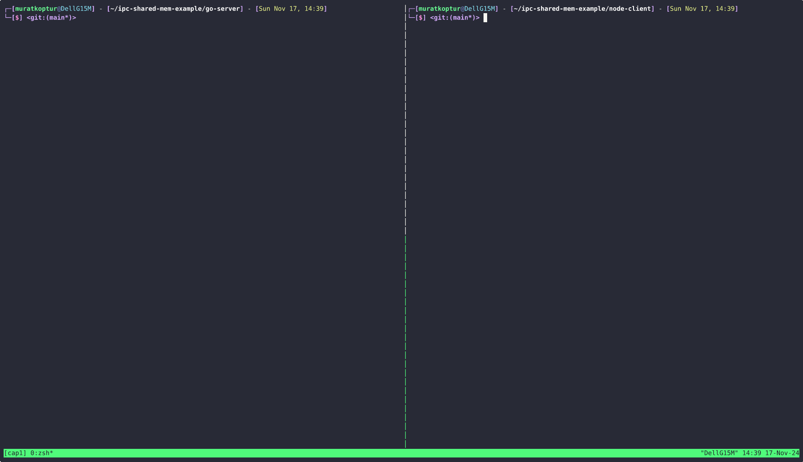

# Inter-Process Communication Example

DON'T USE THIS IN PRODUCTION. This example does not contain any synchronization mechanisms. It is only intended to demonstrate the basic concept of IPC using shared memory.

This repository demonstrates a simple implementation of inter-process communication (IPC) between Go and Node.js using shared memory through memory-mapped files.

The example consists of two programs:

* A Go server that writes data to shared memory
* A Node.js client that reads the data from shared memory

## Our Paid Apps

* [tradeslyFX Forex AI Roboadvisor](https://play.google.com/store/apps/details?id=com.tradesly.tradeslyfx)

* [tradeslyPro Cryptocurrency AI Roboadvisor](https://play.google.com/store/apps/details?id=com.tradesly.tradeslypro)